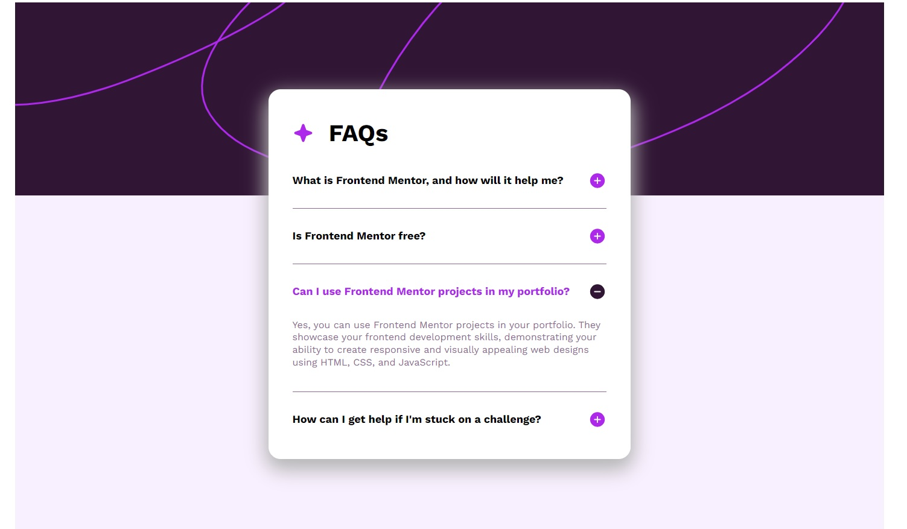
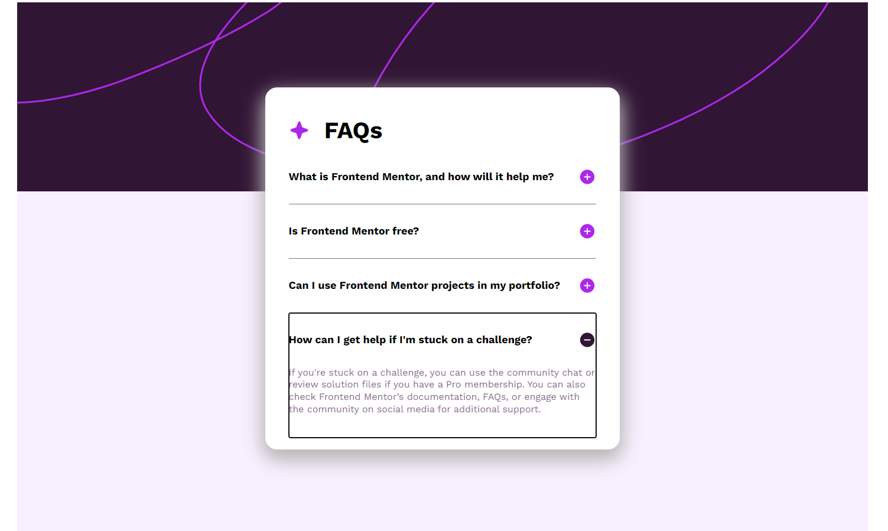

# FAQ accordion solution

## Table of contents

- [Overview](#overview)
  - [Description](#description)
  - [Usage](#usage)
  - [Screenshot](#screenshot)
  - [Links](#links)
- [My process](#my-process)
  - [Built with](#built-with)
  - [What I learned](#what-i-learned)

## Overview

### Description

In this application, users have the opportunity:

- Hide/Show the answer to a question when the question is clicked
- Navigate the questions and hide/show answers using keyboard navigation alone
- View the optimal layout for the interface depending on their device's screen
  size
- See hover and focus states for all interactive elements on the page

### Usage

- Mouse

When you click on a question item, the answer expands. If you click on another
item, the previous item will close and the current one will open.

- Keyboard

When you press the "Tab" button, you select the current question item. The
selection is made by "Enter". Navigation is carried out using the "up" and
"down" buttons

### Screenshot

- Mouse control: 

- Keyboard control: 

### Links

- Solution URL:
  [Add solution URL here](https://github.com/VitaliySaburdo/faq-accordion)
- Live Site URL:
  [Add live site URL here](https://vitaliysaburdo.github.io/faq-accordion/)

## My process

### Built with

- Parcel
- Semantic HTML5 markup
- CSS custom properties
- Flexbox
- Mobile-first workflow
- JS

### What I learned

Set up the Parcel work environment. Deploy to gh-pages. Menu styling. Reviewed
the basics of JS.
